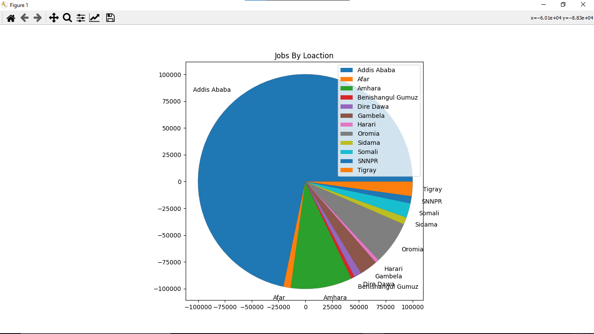

<h1 align="center"> 
    ✨ EthioJobs✨ 
</h1>
<h3 align="center"> 
    Search and Find Jobs in Ethiopia
</h3>
<p align="center">
    <a href="https://python.org">
        
    </a>
<h3 align="center"> 
   Easy start 
    <logger>
    critical warning Use pycharm No vscode No sublime No Vim No nothing.
</h3>

```yaml
    when you want to use this module always import those stuffs and use pprint function instend instead of defualt print fucntion.
    
    
    from Ethio_jobs.ethio_jobs import EthioJobs 
    from Ethio_jobs.deeptable import TableData 
    from Proxy import proxies
    from pprint import pprint
```
<b>input code</b>
```yaml
uses

To search how many jobs are available in ethio jobs
create an instance of EthioJobs form EthioJobs class
my_job = EthioJobs('manager')
pprint(my_job.numberofjobs())
```
<b>output</b>
```console
132 manager jobs has been found!
```
<b>input code</b>
```yaml
To get the title of all available mangment jobs
pprint(my_job.scraped_jobs_title(),indent=3)
```
<b>output</b>
```console
['ACCOUNTANT ','Accountant ( COST ACCOUNTANT ; FACTORY EXP MUST) ','Marketing  Department Manger ',
 'Project Director ','Manager - ERP Management and Support ','Import and Export Coordinator ',
 'Hygiene & Sanitation Officer ','Tender Division Manager ','WASH Project Coordinator ',
 'Immediate Vacancy - Program Officer – Operation ']
 ```
<b>input code</b>
```yaml
To get the campany names only

my_job = EthioJobs('manager')
pprint(my_job.scraped_campany_names(),indent=3)
```
<b>output</b>
```console
['Abays Trading PLC','Abays Trading PLC','Abays Trading PLC',
 'Abays Trading PLC','Gift Real Estate P.L.C','Gift Real Estate P.L.C',
 'Geneva Global','Geneva Global','Safaricom Telecommunications Ethiopia PLC',
 'Safaricom Telecommunications Ethiopia PLC','Senselet Food Processing PLC','Senselet Food Processing PLC',
 'The Lutheran World Federation World Service - Ethiopia','The Lutheran World Federation World Service - Ethiopia',
 'Gift Real Estate P.L.C','Gift Real Estate P.L.C','Plan International Ethiopia',
 'Plan International Ethiopia','Cuso International','Cuso International']
```
<b>input code</b>
```yaml
To get dead line dates for query job 
N.B returns only dead  link like a list object 
my_job = EthioJobs('manager')
pprint(my_job.scraped_campany_jobs_dead_line(),indent=3)
```

<b>output</b>

```console
['Dec 14, 2021','Dec 14, 2021','Dec 11, 2021',
 'Dec 13, 2021','Dec 10, 2021','Dec 13, 2021',
 'Dec 13, 2021','Dec 11, 2021','Dec 10, 2021',
 'Dec 14, 2021']
```
<b>input code</b>
```yaml
To get query campany jobs info

my_job = EthioJobs('manager')
pprint(my_job.scraped_campany_jobs_info())
```

<b>output</b>
```console
['  Summary of Role and Responsibilities      Will be responsible for all '
 'financial and of the company and will report to and work closely with, the '
 'company management team.      Finance Management      Overall responsibility '
 'for all aspects of financial management and control.  Effective financial '
 'reporting for the company, in a timely, accurate, relevant manner.  '
 'Maintaining accounts general...',
 '',
 '  About Geneva Global     Geneva Global is an international philanthropy '
 'advising company that provides strategic advice, independent research, '
 'active program and grant management, and impact measurement to individuals, '
 'foundations, companies, and other organizations. The company is a subsidiary '
 'of Global Impact, a trusted advisor, intermediary, and implementing partner '
 'in the international...',
 '  About Us    Safaricom Telecommunications Ethiopia Plc is a company '
 'supporting Ethiopia’s digital transformation. As a member of the Vodacom '
 'family, we have a wealth of experience connecting over 334 million people '
 'globally and over 180 million people in Africa across our network. We look '
 'forward to partnering with Ethiopians as we build a new network in '
 'Ethiopia.   We are setting the...',
 '  Introduction  :  Senselet imports some raw materials, spare parts, '
 'production consumables and specific equipment or vehicles for projects .The '
 'import and export coordinator is responsible for managing the import and the '
 'export of the company, in particular the follow up of all imported and '
 'exported items, working together with procurement coordinator, Manage the '
 'customs cleaning process with...',
 ' Lutheran World Federation World Service Ethiopia is a registered foreign '
 'charity which has been operating in Ethiopia since 1973 implementing various '
 'development and humanitarian projects in different parts of Ethiopia. LWF '
 'Ethiopia works closely with the Ethiopian Evangelical Church Mekane Yesus '
 '(EECMY), the Ethiopian Government, UN organizations and other funding '
 'partners.xa0 Its thematic...',
 '',
 ' Plan International is an independent child rights and humanitarian '
 'organisation committed to children living a life free of poverty, violence '
 'and injustice.    We actively unite children, communities and other people '
 'who share our mission to make positive lasting changes in children’s and '
 'young people’s lives. We support children to gain the skills, knowledge and '
 'confidence they need to claim...',
 '  Summary     Cuso International is a Canadian development non-profit '
 'organisation that works to reduce poverty and inequality through the efforts '
 'of highly skilled volunteers, collaborative partnerships and compassionate '
 'donors.xa0 Cuso International main areas of interventions are (i) '
 'harnessing the power of volunteerism to achieve the SDGs; (ii) advancing '
 'gender equality and the...']
```
<b>input code</b>
```yaml
To get over all information about your query
my_job = EthioJobs('manager')
pprint(my_job.job_over_all(),indent=5)
```
<b>output</b>
```console
['Today','Dec 14, 2021','Abays Trading PLC','Addis Ababa','Senior Level (5+ years experience)','Dec 14, 2021',
 'Today','Dec 14, 2021','Abays Trading PLC','sululta, Oromia','Mid Level ( 2+ - 5 years experience)','Dec 14, 2021',
 'Yesterday','Dec 11, 2021','Gift Real Estate P.L.C','Addis ababa, Addis Ababa','Managerial Level (Manager, Supervisor, Director)','Dec 11, 2021',
 'Yesterday','Dec 13, 2021','Geneva Global','Addis Ababa','Managerial Level (Manager, Supervisor, Director)','Dec 13, 2021',
 '2 days ago','Dec 10, 2021',,'Safaricom Telecommunications Ethiopia PLC',Addis Ababa','Managerial Level (Manager, Supervisor, Director)','Dec 10, 2021'
 '2 days ago','Dec 13, 2021','Senselet Food Processing PLC','Addis Ababa','Senior Level (5+ years experience)','Dec 13, 2021',
 '2 days ago','Dec 13, 2021','The Lutheran World Federation World Service - Ethiopia','Amhara region, Amhara','Mid Level ( 2+ - 5 years experience)','Dec 13, 2021',
 '2 days ago','Dec 11, 2021','Gift Real Estate P.L.C','addis ababa, Addis Ababa','Managerial Level (Manager, Supervisor, Director)','Dec 11, 2021',
 '2 days ago','Dec 10, 2021','Plan International Ethiopia','Gambela','Mid Level ( 2+ - 5 years experience)','Dec 10, 2021',
 '2 days ago','Dec 14, 2021','Cuso International','Addis Ababa','Senior Level (5+ years experience)','Dec 14, 2021']
 
 
```
<b>input code</b>
```yaml
To see new job by catagory
job = TableData()
pprint(job.jobs_by_catagory())
```
<b>output</b>
```console
[('Accounting and Finance Jobs',
  '53',
  'https://www.ethiojobs.net/browse-by-category/Accounting%20and%20Finance/'),
 ('Admin, Secretarial and Cl... Jobs',
  '8',
  'https://www.ethiojobs.net/browse-by-category/Admin%2C%20Secretarial%20and%20Clerical/'),
 ('Agriculture Jobs',
  '12',
  'https://www.ethiojobs.net/browse-by-category/Agriculture/'),
 ('Architecture and Construc... Jobs',
  '1',
  'https://www.ethiojobs.net/browse-by-category/Architecture%20and%20Construction/'),
 ('Automotive Jobs',
  '1',
  'https://www.ethiojobs.net/browse-by-category/Automotive/'),
 ('Banking and Insurance Jobs',
  '8',
  'https://www.ethiojobs.net/browse-by-category/Banking%20and%20Insurance/'),
 ('Business Development Jobs',
  '13',
  'https://www.ethiojobs.net/browse-by-category/Business%20Development/'),
 ('Business and Administration Jobs',
  '35',
  'https://www.ethiojobs.net/browse-by-category/Business%20and%20Administration/'),
 ('Communications, PR and Jo... Jobs',
  '3',
  'https://www.ethiojobs.net/browse-by-category/Communications%2C%20PR%20and%20Journalism/'),
 ('Community Service Jobs',
  '5',
  'https://www.ethiojobs.net/browse-by-category/Community%20Service/'),
 ('Consultancy and Training Jobs',
  '19',
  'https://www.ethiojobs.net/browse-by-category/Consultancy%20and%20Training/'),
 ('Creative Arts Jobs',
  '1',
  'https://www.ethiojobs.net/browse-by-category/Creative%20Arts/'),
 ('Customer Service Jobs',
  '1',
  'https://www.ethiojobs.net/browse-by-category/Customer%20Service/'),
 ('Development and Project M... Jobs',
  '33',
  'https://www.ethiojobs.net/browse-by-category/Development%20and%20Project%20Management/'),
 ('Economics Jobs',
  '16',
  'https://www.ethiojobs.net/browse-by-category/Economics/'),
 ('Education Jobs',
  '8',
  'https://www.ethiojobs.net/browse-by-category/Education/'),
 ('Engineering Jobs',
  '10',
  'https://www.ethiojobs.net/browse-by-category/Engineering/'),
 ('Environment and Natural R... Jobs',
  '5',
  'https://www.ethiojobs.net/browse-by-category/Environment%20and%20Natural%20Resource/'),
 ('Health Care Jobs',
  '27',
  'https://www.ethiojobs.net/browse-by-category/Health%20Care/'),
 ('Hotel and Hospitality Jobs',
  '2',
  'https://www.ethiojobs.net/browse-by-category/Hotel%20and%20Hospitality/'),
 ('Human Resource and Recrui... Jobs',
  '7',
  'https://www.ethiojobs.net/browse-by-category/Human%20Resource%20and%20Recruitment/'),
 ('Information Technology Jobs',
  '7',
  'https://www.ethiojobs.net/browse-by-category/Information%20Technology/'),
 ('Languages Jobs',
  '1',
  'https://www.ethiojobs.net/browse-by-category/Languages/'),
 ('Legal Jobs', '6', 'https://www.ethiojobs.net/browse-by-category/Legal/'),
 ('Logistics, Transport and ... Jobs',
  '10',
  'https://www.ethiojobs.net/browse-by-category/Logistics%2C%20Transport%20and%20Supply%20Chain/'),
 ('Management Jobs',
  '21',
  'https://www.ethiojobs.net/browse-by-category/Management/'),
 ('Manufacturing Jobs',
  '2',
  'https://www.ethiojobs.net/browse-by-category/Manufacturing/'),
 ('Media and Journalism Jobs',
  '1',
  'https://www.ethiojobs.net/browse-by-category/Media%20and%20Journalism/'),
 ('Natural Sciences Jobs',
  '7',
  'https://www.ethiojobs.net/browse-by-category/Natural%20Sciences/'),
 ('Pharmaceutical Jobs',
  '3',
  'https://www.ethiojobs.net/browse-by-category/Pharmaceutical/'),
 ('Purchasing and Procurement Jobs',
  '2',
  'https://www.ethiojobs.net/browse-by-category/Purchasing%20and%20Procurement/'),
 ('Research and Development Jobs',
  '4',
  'https://www.ethiojobs.net/browse-by-category/Research%20and%20Development/'),
 ('Retail, Wholesale and Dis... Jobs',
  '4',
  'https://www.ethiojobs.net/browse-by-category/Retail%2C%20Wholesale%20and%20Distribution/'),
 ('Sales and Marketing Jobs',
  '17',
  'https://www.ethiojobs.net/browse-by-category/Sales%20and%20Marketing/'),
 ('Science and Technology Jobs',
  '3',
  'https://www.ethiojobs.net/browse-by-category/Science%20and%20Technology/'),
 ('Security Jobs',
  '5',
  'https://www.ethiojobs.net/browse-by-category/Security/'),
 ('Social Sciences and Commu... Jobs',
  '39',
  'https://www.ethiojobs.net/browse-by-category/Social%20Sciences%20and%20Community/'),
 ('Telecommunications Jobs',
  '1',
  'https://www.ethiojobs.net/browse-by-category/Telecommunications/'),
 ('Veterinary Services Jobs',
  '2',
  'https://www.ethiojobs.net/browse-by-category/Veterinary%20Services/'),
 ('Warehouse, Supply Chain a... Jobs',
  '10',
  'https://www.ethiojobs.net/browse-by-category/Warehouse%2C%20Supply%20Chain%20and%20Distribution/'),
 ('Water and Sanitation Jobs',
  '5',
  'https://www.ethiojobs.net/browse-by-category/Water%20and%20Sanitation/')]
```

<b>input code</b>
```yaml
To get latest available goverment jobs
job = TableData()
pprint(job.latest_goverment_jobs())
```
<b>output</b>
```console
[('Purchase Expert',
  ' 3 days  ago',
  'Ethiopian Trade Business Corporation Fruit and...'),
 ('Technical Assistant', ' 4 days  ago', 'Wachemo University'),
 ('Technical Assistant', ' 4 days  ago', 'Wachemo University'),
 ('Lecturer and Above', ' 4 days  ago', 'Wachemo University'),
 ('Senior Technical Assistant', ' 4 days  ago', 'Wachemo University'),
 ('Lecturer and Above', ' 4 days  ago', 'Wachemo University'),
 ('Lecturer and Above', ' 4 days  ago', 'Wachemo University'),
 ('Lecturer and Above', ' 4 days  ago', 'Wachemo University'),
 ('Lecturer and Above', ' 4 days  ago', 'Wachemo University'),
 ('Lecturer and Above', ' 4 days  ago', 'Wachemo University')]
```
<b>input code</b>
```yaml
To get available jobs by location
job = TableData()
pprint(job.jobs_by_location())
```
```console
[('Jobs in Addis Ababa', '132'),
 ('Jobs in Afar', '2'),
 ('Jobs in Amhara', '17'),
 ('Jobs in Benishangul Gumuz', '1'),
 ('Jobs in Dire Dawa', '2'),
 ('Jobs in Gambela', '5'),
 ('Jobs in Harari', '1'),
 ('Jobs in Oromia', '12'),
 ('Jobs in Sidama', '2'),
 ('Jobs in Somali', '4'),
 ('Jobs in SNNPR', '2'),
 ('Jobs in Tigray', '4')]
```

<h2> welcome to the intersting part live graph using matplotlib</h2>

<b>input code</b>

```yaml
To view pie plot graph in new avalible jobs by location
job = TableData()
pprint(job.pyplot_job_by_location_pie())
```
<b>output</b>
```console
None
```

 <h1 align="center"> 
    ✨ EthioJobs✨ 
</h1>
<h3 align="center"> 
    Search and Find Jobs in Ethiopia
</h3>
<p align="center">
    <a href="https://python.org">
        
    </a>
